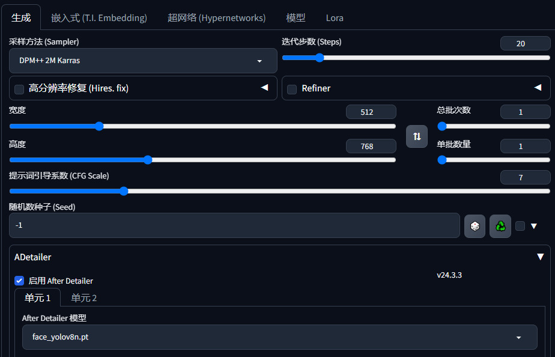
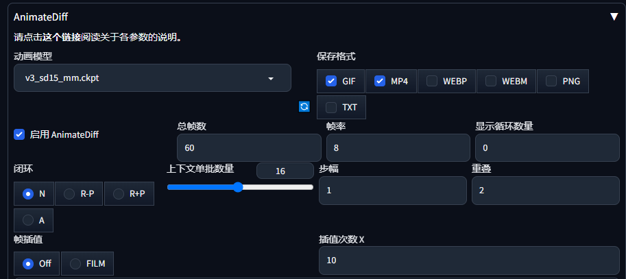

### text2image

文生图模块

### positive prompt（出自 Nenly 同学的教程）

best quality, masterpiece, 1girl, upper body, detailed face, looking at viewer, outdoors, upper body, standing, outdoors,

0: (spring:1.2), cherry blossoms, falling petals, pink theme,

16: (summer:1.2), sun flowers, hot summer, green theme

32: (autumn:1.2), falling leaves, maple leaf, yellow trees, orange theme

48: (winter:1.2), snowing, snowflakes, white theme

### negative prompt

(worst quality:2),(normal quality:2),bad anatomy

### checkpoint

dgirl

### 分辨率

512x768

### CFG Scale

7

### motion model

v3_sd15_mm

### 采样方法

DPM++ 2M Karras

### AnimateDiff 参数

- 启动 AnimateDiff √
- 总帧数 60
- 帧率 8
- 重叠 2
- 闭环 N
- 帧差值 Off

  其余默认

### Adetailer

开了可以修正不正常的脸，如果模型本身够好也可以不开。
开启后会显著延长生成时间

